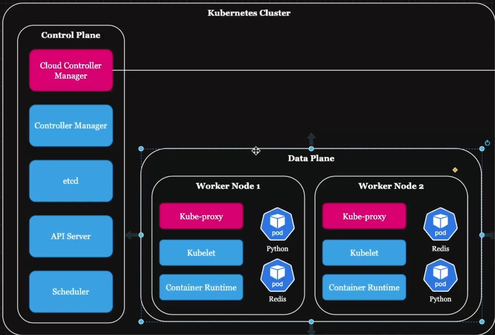
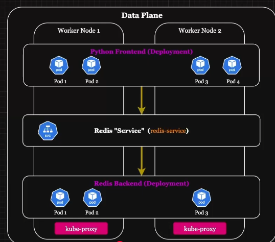
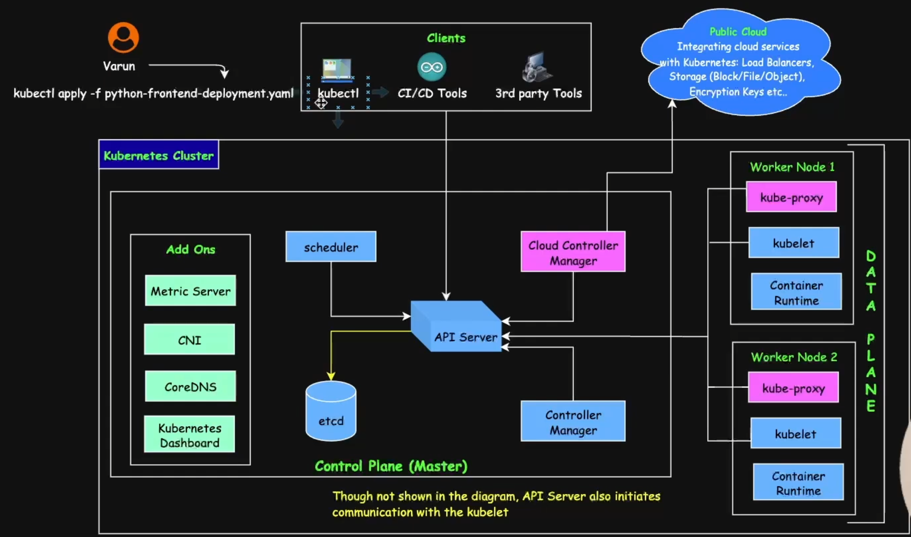
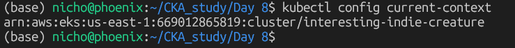
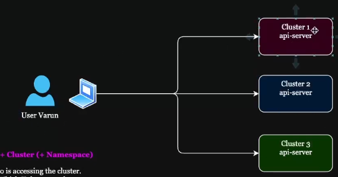
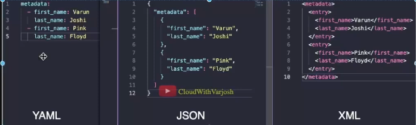
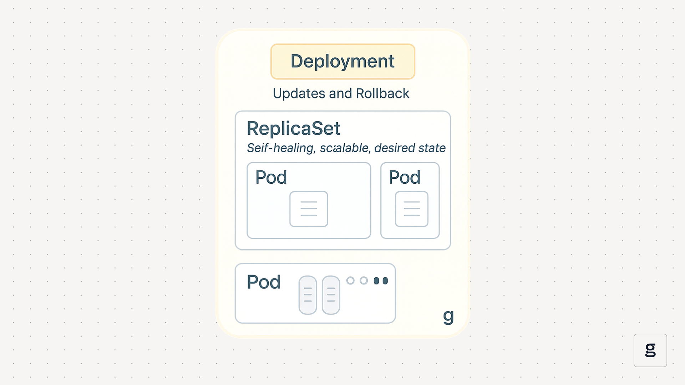

Learning Kubernetes through taking the CKA.  This will give me guidance on how to proficiently navigate and troubleshoot Kubernetes 


Realized making all these folders is causing unnecessary bloat and too many README files so i'll put them all under the main README

# Day 6 notes
## Kubernetes scaling
so far we only learned how to setup a single container using Docker.  this is great for local development but what if I python application gets popular.  what if 100 users want to access your application?  we need to utilize auto-scaling.

### Here is where Kubernetes (k8s) comes to play


#Day 7 notes
## What is Kubernetes

### Kubernetes pod
A Pod is the smallest and most basic deployable unit in Kubernetes.  
Pod can have multiple containers which mainly share:
- Networking (Network Namespaces)
- Storage

Why multiple container?
Sidecar pattern (Logging, monitoring, proxy, reverse proxy)


### Deployment
It ensures that the desired nuber of Pods are running.
Key features:
- Replica Management
- Rolling Updates and Rollbacks
- Declarative Configuration

Even if you have a single Pod in the Deployment.  The Deployment will try to restart the Pod incase it fails

If I want to update my application, Deployment can update the Pods section by section (rolling update) ensuring no downtime

Declarative Configuration
when I tell the deployment to run 10 Pods.  I dont have to manage that 10 Pods will run



### How is the control plane setup?
kubelet


# Day 7 notes


## What is a Pod
A Pod is the smallest and most basic deployable unit in Kubernetes.
Pod can have multiple containers which main share:
- Network (Network Namespaces)
- Storage

Why multiple container?
Sidecar pattern (Logging, monitoring, proxy, reverse proxy)

## What is a Deployment?
It ensures that the desired number of Pods are **running**.
Key features:
- Replica Management
- ROlling Updates and ROllbacks
- Declarative Configuration


## kube-proxy main functions
it is its' own seperate Pod

1. Service-to-pod routing rules
2. Load balancing
3. Health Checks


## kubelet
1. Watches the API server for Pods assigned to its node
Every kubelet only cares about work scheduled specifically to the node it's running on — it ignores everything else in the cluster.
2. Tells containerd to pull the image and start the container
This is the exact step where your architectn/my-python-image:v1 got pulled and started — the kubelet on whichever worker node the Scheduler picked told containerd "run this."
3. Runs health checks (liveness/readiness probes)
If you'd configured probes on your my-python-app, the kubelet is what actually executes them repeatedly and restarts the container if a liveness check fails.
4. Reports status back to the API server
This is how kubectl get pods shows Running/Ready — the kubelet on the node is continuously reporting "here's the real state of what I'm running" back up through the API server, which is what lets the Deployment controller compare desired vs. actual state and react if something's wrong (like your ImagePullBackOff situation).
5. Manages the node itself
Reports node-level health (CPU/memory pressure, disk space) — this is what feeds into things like Karpenter/EKS Auto Mode deciding "this node is full, provision another one," which is exactly what happened when your second c6a.large node got created.





In a manifest file.  each kind is considered an object


# Day 8 notes

## Setting Kind (**K**ubernetes **in Do**cker) Cluster locally
[Setup link for kubectl](https://kubernetes.io/docs/tasks/tools/install-kubectl-linux/) | [Setup link for KIND](https://kind.sigs.k8s.io/docs/user/quick-start/)

from my previous side learnings I setup kubectl to direct to my AWS EKS.  I will now change it to direct it's push to KIND.  Using the command below to verify:
```
kubectl config current-context
```


### Create KIND cluster
After creating my kind-cluster.yaml file stored in Day 8, I ran the command to create the cluster but got an error.  It showed me there was an indentation error in line 4 so I fixed that by adding a break space for nodes and also the image line was not indented correctly
```
(base) nicho@phoenix:~/CKA_study/Day 8$ kind create cluster --name my-first-cluster --config kind-cluster.yaml
ERROR: failed to create cluster: could not determine kind / apiVersion for config: yaml: line 4: did not find expected '-' indicator
```

Ran the command below to see my cluster listed
```
kind get clusters
```

**side note.  when you create a cluster it automically also enters all that information into 
```
~/.kube/config
```
it will automatically select the latest cluster
**side note
kube/config is unsecure
### How does Kubectl connect to the cluster API Server?
it used the client certificate data and the client key data that is stored in the kube config file.


## What is KUbernetes Context
How a user accesses a specific cluster (and optionally, a namespace)


Verify list of context
```
kubectl config get-contexts
```

Change to kind context
```
kubectl config use-context kind-my-first-cluster
```


## What is Linux Foundation and CNCF
[EXAM link](https://training.linuxfoundation.org/certification/certified-kubernetes-administrator-cka/)
| As of July 7, 2026, The exam is based on Kubernetes v1.35.


## Understanding Kubernetes Origin
- Developed by Google
- Open sourced release in 2014
- Kubernetes become a part of the CloudNative Computing Foundation (CNCF) in 2015.
- Community-driven: Kubernetes is now developed and maintained by a large, active open-source community


# Day 9 notes

## Imperative vs. Delcaritve
There are 2 Approachs (to System Configuration)

### Imperative
- Instructs the system on how to achieve the desired state, step-by-step
- Simpler for quick, one-off tasks
- E.g. ```kubectl run my-pod --image=nginx```

### Declarative
- Describes what the desired state should be, letting the system figure out how to achieve it.
- Better for managing complex configurations
- E.g. kubectl apply -f pod.yaml

#### Why is Delcarative preferred?
- Idempotency

- Version Control

- Simplicity


## Intro to YAML
- Human-readable **data serialization** language
- Simple: Easy to read and write, making it user-friendly
- Uses indentation and line breaks
- Widely used in DevOps tools 
- Extension: .yml or .yaml


Data Types:
1. Scalar (strings, integers, floats, booleans, and null)
2. Dictionaries (aka Maps)
3. Lists (aka Arrays)

[Practice-File](<Days/Day 9/practice.yaml>)
## Kubernetes Pod Manifest Example


## Pod documentation


# Day 10 notes

```
kubectl get api-resources
```


## Replication Controller
Allows for self healing properties

Selector is only exact match

## ReplicaSets
Same core job as Replication Controller but is a replacement for it.

ReplicaSets have Selector expressiveness.
### matchLabels
used for when you need exact-match AND logic


### matchExpressions Operator types
Used for when you need OR  or presence checks

#### In
any value in the list
#### NotIn
everything except the list

#### Exists

```
matchExpressions:
  - key: tier
    operator: In
    values: [frontend, backend]
```


## Equality * Set-Based labels * Selectors
These are how objects get organized and linked to each other,  since Kubernetes doesn't rely on names or hierachy for that
```
metadata:
  labels:
    app: frontend
    env: production
    tier: web
```
You can put arbitrary keys/values here.  A single object can have multiple labels, and the same label can be applied to many objects.


Selectors are used to select a specific label

The most common use is a Service or Deployment finding the pods it shoudl manage


## Deployments
A Deployment's pod template has labels, and its ```spec.selector``` must match those labels so it knows which pods it owns

A Service does the same thing to decide which pods to route traffic to


Acts as a manager for ReplicaSets


### Real use case
You would always use Deployment kind and never ReplicaSets/ReplicaControllers




# Day 11 Notes
## Microservices & 3-Tier Architecture | Software design patterns

### Single codebase
no 3-tier design, application was deployed as a single codebased
  Monolithic design
  Means the application is self-contained, tightly integrated software system where all components -- UI, business logic, and database -- are part of a single codebase and deployed as a single unit


Lack of flexibility in development
limited scalability
difficult maintenance and upgrades

### 3-tier

#### Web Tier (frontend)
User interface that interacts with the application

#### Application Tier (Backend)
Handles business logic, processing and communication with databases

#### Data Tier (Database)
stores, manages, and retrieves data


### Database architecture
Kubernetes would not be used to deploy databases in real use cases
  most of the time*
Kubernetes was designed for staeless, ephemeral workloads rather than stateful applications.
  Kubernetes inherently treats containers as disposable.

It is possible to use Kubernetes but you would need some sort of persistent volume such as AWS ELB

You need to take great care that the container does not terminate early and leave the file open and incomplete

You also need to ensure that the file that the database operates on is in a very secure file systme that is not bould to the life cycle of the container.  
You need ot make sure that only one process accesses this file at a time and that the file integrity is good and whoel at all times.


# Day 13 Notes


save time creating YAML
-o yaml


# Day 15 Notes

Scheduler
- Resource availability (CPU, memory).
- Taints and tolerations (node restrictions).
- Affinity and anti-affinity rules


## Manual Scheduling
means explicitly assigning a pod to a node using the nodeName field in the pod's YAML manifest.  This completely bypasses the Kubernetes scheduler

### Why use manual scheduling
- Troubleshooting & Debugging
- Testing Node-Specific WOrkloads
- Kubernetes Scheduler is Unavailable

```
spec:
  nodeName: manual-node #where you force the pod to run in which node
  containers:
  - name: nginx
```

if you have nodeName set to a node that isn't in the cluster, the Pod will be stuck on pending