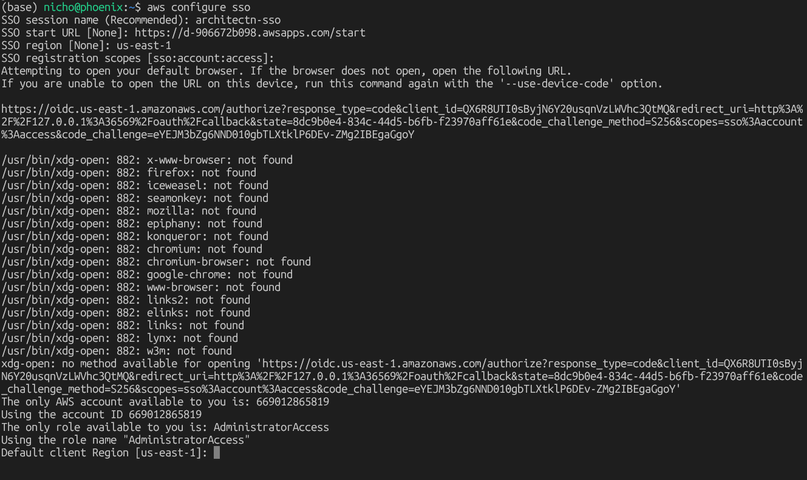
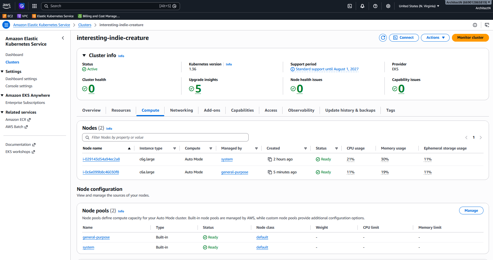
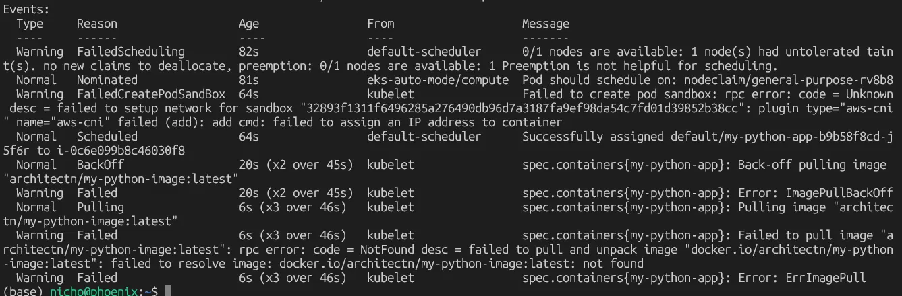
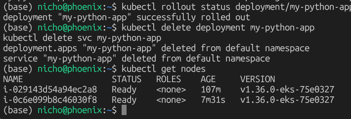
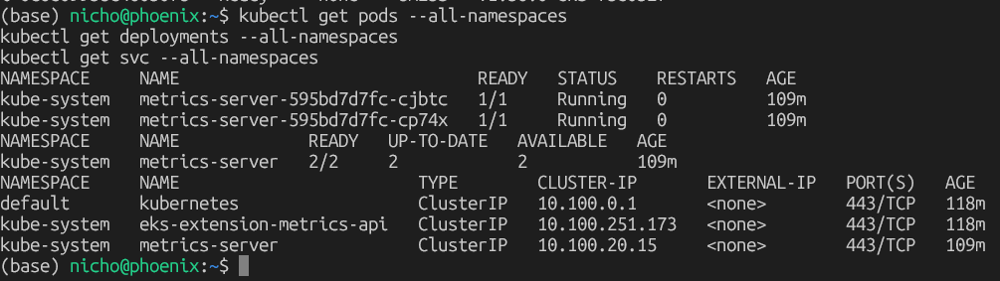

These are my extra side notes of curiosity while learning Kubernetes


# Q. How is kubernetes setup?

## Control Plane
In EKS: AWS does this entirely — you never see, touch, or create these manifests at all. Full stop.

In kubeadm (self-managed): ```kubeadm init``` auto-generates these 4 static pod manifests for you, based on flags/config you pass to the init command (like --pod-network-cidr) — you're not hand-authoring kube-apiserver.yaml from scratch either.

kind: does this internally too, inside its Docker-container-as-node setup — also hidden from you.

```
/etc/kubernetes/manifests/
├── etcd.yaml                      → 1 pod, 1 container
├── kube-apiserver.yaml            → 1 pod, 1 container  ← this one
├── kube-controller-manager.yaml   → 1 pod, 1 container
└── kube-scheduler.yaml            → 1 pod, 1 container
```


## kubectl - the client/remote control
kubectl is a **CLI tool that talks to any Kubernetes cluster's API server**.  It doesn't create clusters,
it just sends commands and reads state

you point at:
- A **kind** cluster on your laptop
- A **kubeadm** cluster you built by hand
- An **EKS** cluster in **AWS**
- A **GKE** or **AKS** cluster

## kind - the cluster builder (for local/dev use)

I'll be setting up **kind** (Kubernetes **IN Docker**)  for my CKA study..  This creates a **real, functioning Kubernetes cluster**, using Docker containers to simulate nodes

**Setups steps in WSL2**
```
# 1. Install kubectl (the CLI to talk to any cluster)
curl -LO "https://dl.k8s.io/release/$(curl -L -s https://dl.k8s.io/release/stable.txt)/bin/linux/amd64/kubectl"
chmod +x kubectl && sudo mv kubectl /usr/local/bin/

# 2. Install kind
curl -Lo ./kind https://kind.sigs.k8s.io/dl/latest/kind-linux-amd64
chmod +x ./kind && sudo mv ./kind /usr/local/bin/

# 3. Write a kind-config.yaml defining 1 control-plane + 2 workers (matches your diagram)
# 4. Run:
kind create cluster --config kind-config.yaml --name cka-lab
```

### Kubernetes manifests 
(YAML files) go to the cluster via kubectl. A manifest doesn't contain your app — it's a reference to an image sitting in a registry, plus instructions for how to run it:

### The full flow, end to end

1. docker build → build your image locally
2. docker push architectn/my-flask-app → image lands in Docker Hub (or ECR)
3. Write a Deployment YAML referencing that image
4. ```kubectl apply -f deployment.yaml``` → sent to AWS's managed API server
5. AWS's scheduler decides which of your worker nodes should run it
6. That worker node's kubelet pulls the image and starts the container


### Made an EKS to test
EKS cost 10 cents/Hr 
- even if the cluster is empty

EKS will handle the control plane and scale it automatically

You can also change the configuration to have it reserve extra headroom to spin up the control plane faster (cost $$$)


#### Pullling from Private Docker Hub 
to point to it will need the Docker Hub token stored
I realized I can use Parameter Store to store the username and password 
```
DOCKER_TOKEN=$(aws ssm get-parameter --name /dockerhub/token --with-decryption --query 'Parameter.Value' --output text)

kubectl create secret docker-registry dockerhub-creds \
  --docker-username=architectn \
  --docker-password=$DOCKER_TOKEN \
  --docker-server=https://index.docker.io/v1/
```

# Q. How to connect to a kubernetes provider
## Setting up AWS CLI

Required for me to send commmands to EKS

```
curl "https://awscli.amazonaws.com/awscli-exe-linux-x86_64.zip" -o "awscliv2.zip"
unzip awscliv2.zip
sudo ./aws/install

# verify
aws --version
```

## configuring credentials
Required to identify myself and grant access to AWS resources
### Old way
add the UserID and Secret access key

configures default profile
```
aws configure
```

configure different profile/utilize multiple diff logins
```
aws configure --profile architectn
```


### New way (better)
Using Identity Center.  this prevents long-live access credentials from being stored

```
aws configure sso
```


I had to copy the link and paste it in browser and sign-in/mfa.  then authorize and done


verify
```
aws sts get-caller-identity --profile AdministratorAccess-669012865819
```

Next I had to delete the other previous profiles setup
```
vim ~/.aws/credentials
vim ~/.aws/config
```

now I can run commands like:
```
aws eks list-clusters --profile architectn
```

## setup kubectl to talk to your Provider
I now need to setup kubectl to talk to EKS using the command below: 
```
aws eks update-kubeconfig --name interesting-indie-creature --region us-east-1 --profile architectn
```


\
\
It writes a new entry into ```~/.kube.config```
```
clusters:
- name: arn:aws:eks:us-east-1:669012865819:cluster/interesting-indie-creature
  cluster:
    server: https://9D9FFEA971875A46FB0F125716A169C9.gr7.us-east-1.eks.amazonaws.com
    certificate-authority-data: <base64 cert>

contexts:
- name: arn:aws:eks:us-east-1:669012865819:cluster/interesting-indie-creature
  context:
    cluster: arn:aws:eks:us-east-1:669012865819:cluster/interesting-indie-creature
    user: arn:aws:eks:us-east-1:669012865819:cluster/interesting-indie-creature

current-context: arn:aws:eks:us-east-1:669012865819:cluster/interesting-indie-creature

users:
- name: arn:aws:eks:us-east-1:669012865819:cluster/interesting-indie-creature
  user:
    exec:
      command: aws
      args: ["eks", "get-token", "--cluster-name", "interesting-indie-creature", "--profile", "architectn"]
```


# Q. Deploying your manifest

```
cat <<EOF > my-python-deployment.yaml
apiVersion: apps/v1
kind: Deployment
metadata:
  name: my-python-app
spec:
  replicas: 2
  selector:
    matchLabels:
      app: my-python-app
  template:
    metadata:
      labels:
        app: my-python-app
    spec:
      containers:
      - name: my-python-app
        image: architectn/my-python-image:v1
        ports:
        - containerPort: 5000
EOF
```


```
kubectl apply -f my-python-deployment.yaml
```
It essentially does: "here's a Deployment object, please create/update it" — the YAML gets converted to JSON and POSTed to the API server's REST endpoint.


Watch it come up
```
kubectl get pods -w
```


### Side learnings on deployment
A manifest gets pushed (via the API server) into etcd, and everything else watches the API server (not etcd directly) and does its thing to move actual/current state toward the desired state stored in etcd.
Two small but important precision points:
1. Nothing talks to etcd except the API server
    - The scheduler, controllers, and kubelets never query etcd directly — they all watch the API server, which is the sole gatekeeper in front of etcd. 
2. This is literally called the "reconciliation loop" — the fundamental pattern of ALL Kubernetes controllers
Every controller (Deployment controller, ReplicaSet controller, Scheduler, kubelet) runs the exact same loop, forever:
    1. Watch API server for changes to relevant objects
    2. Compare: desired state (what's in etcd) vs. current state (what's actually true)
    3. If different → take action to close the gap
    4. Repeat forever

This is why Kubernetes self-heals: if a Pod crashes, current state no longer matches desired state (etcd still says "2 replicas should exist," but only 1 does). The ReplicaSet controller notices this gap on its next watch cycle and creates a replacement — nobody has to tell it to; it's constantly comparing reality against etcd's stored desired state, forever, as a background loop.


### API Server
This matters because it's why the API server is called "the front door to the cluster" — it's the only component with direct etcd access, enforcing auth/validation on every read and write.
### etcd
**etcd is the actual persistent state** — if etcd data is lost/corrupted, your cluster effectively loses all memory of what should exist. This is why etcd backups are a real CKA exam topic (etcdctl snapshot save).

### Expose it externally
```
kubectl expose deployment my-python-app --type=LoadBalancer --port=80 --target-port=5000
kubectl get svc my-python-app
```
That'll show an EXTERNAL-IP (an AWS Network Load Balancer hostname) once provisioned — hit that in a browser to confirm your app is actually reachable from the internet.




#### Initially my image failed to resolve


I ran command kubectl describe pod my-python-app-b9b58f8cd-j5f6r


### SHUTDOWN


```
kubectl delete deployment my-python-app
kubectl delete svc my-python-app
```

confirm its gone
```
kubectl get svc
kubectl get pods
```

Watch the EKS AUtoMode scale down the nodes
```
kubectl get nodes
```



instead of waiting for automode to scale down we can just delete the cluster



CLI command to shutdown
```
eksctl delete cluster --name interesting-indie-creature --region us-east-1 --profile architectn
```

I didn't have it so I went into the EKS console -> clicked the cluster -> delete


# Q. importance of a Service
It is not its' own Pod.  It is another **object stored in etcd**, same as a Deployment or Pod spec.

It's a record that says "give me a stable virtual IP, and route traffic to whichever Pods match this label selector."


## what makes the service a reality
1. The Endpoints controller (part of the control plane) — watches the Service's label selector, watches for Pods matching it, and maintains a live list of actual Pod IPs:
redis-service Endpoints: 10.244.1.5:6379, 10.244.1.9:6379, 10.244.2.3:6379
This is just another object in etcd too — still no running process "being" the Service.
    - The Endpoints controller doesn't sit in a loop repeatedly asking "any changes yet? any changes yet?" Instead, it opens a watch connection to the API server — a persistent connection where the API server pushes a notification the instant something relevant changes (a Pod matching the Service's selector is created, deleted, or its IP/readiness changes). This is a fundamental Kubernetes pattern — nearly everything in the control plane works this way (watch, not poll), and it's genuinely worth knowing that distinction for the exam, since "polling" implies wasted resources checking against nothing, while "watch" is push-based and efficient.

2. kube-proxy on every node — watches Services + Endpoints via the API server, and writes the actual iptables/IPVS rules into the node's kernel that make the ClusterIP actually routable, exactly like we walked through with the Redis diagram.

**kube-proxy** is the actual running thing that reads that declaration and makes it real by writing kernel-level networking rules.


(this is helping me conceptualize K8s actual running processes vs. just declarative objects in etcd)